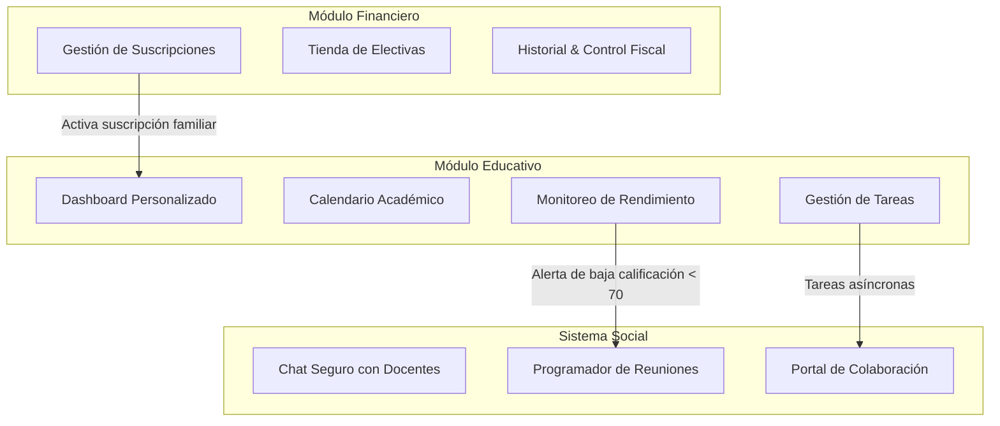

# Plan de Proyecto y Resumen Ejecutivo
## De Supervisor a Co-Aprendiz: Plataforma Educativa Integral para Padres

---

## 🎯 1. Concepto Central: La Dualidad del Rol Parental

La filosofía de diseño de la plataforma se fundamenta en un principio rector: **la redefinición del papel del padre en el proceso escolar**. En lugar de restringir su participación a una supervisión meramente reactiva (basada en el control de daños frente a bajas calificaciones) o, por el contrario, fomentar una inmersión invasiva que interrumpa la dinámica del aula síncrona, la plataforma propone una estructura interactiva dual:

| Rol | Funcionalidad Clave | Límite Estratégico |
| :--- | :--- | :--- |
| **Supervisor** | Visualización en tiempo real de rendimiento, estatus de tareas, repositorio de grabaciones de clase y canales oficiales de comunicación docente. | Acceso total y transparente a las métricas del estudiante, sin capacidad de intervención directa ni interrupción durante las sesiones en vivo. |
| **Co-aprendiz** | Herramientas interactivas de refuerzo académico en el hogar: pizarra de dibujo offline para repasar conceptos gráficos, foros de discusión post-clase guiados, y encuestas rápidas de satisfacción escolar. | Participación asincrónica diseñada exclusivamente para el espacio familiar post-lectivo, preservando la dinámica pedagógica y la autonomía del estudiante en clase. |

> [!WARNING]
> **Principio de Diseño No Invasivo**: Para no diluir el liderazgo del docente ni distraer a los alumnos, la plataforma restringe el acceso directo a transmisiones en vivo. El apoyo parental está orientado a un entorno asincrónico fuera del horario escolar.

---

## 🏗️ 2. Arquitectura Funcional Integrada

El ecosistema de la plataforma se compone de tres módulos modulares estrechamente integrados en torno a un backend con arquitectura **Lakehouse**, permitiendo la interoperabilidad de datos en tiempo real:



### 2.1 Módulo Educativo (Core)
*   **Dashboard Personalizado**: Widgets personalizables que muestran indicadores inmediatos de tareas pendientes, promedios generales (GPA), alertas tempranas de desempeño y accesos rápidos a reuniones docentes.
*   **Calendario Académico Consolidado**: Agenda unificada que recopila fechas límite de entrega de tareas, exámenes programados, clases en línea y consultas docentes virtuales con filtros interactivos de visualización.
*   **Gestión de Tareas y Biblioteca de Recursos**: Espacio estructurado donde el padre visualiza las descripciones de las actividades del estudiante junto a recursos de estudio precargados por el docente (videos grabados, guías en PDF).
*   **Monitoreo de Rendimiento**: Gráficos interactivos SVG integrados directamente para reflejar la evolución temporal de calificaciones, facilitando la identificación rápida de patrones de descenso académico.

### 2.2 Módulo Financiero
*   **Gestión de Suscripciones**: Modelo de facturación recurrente con soporte para perfiles familiares tipo *Family Sharing*, permitiendo vincular múltiples estudiantes bajo un solo pago de suscripción familiar.
*   **Tienda de Contenido Adicional**: Catálogo de cursos adicionales electivos, preparación para exámenes internacionales y tutorías personalizadas a demanda bajo un modelo de compras in-app.
*   **Historial de Transacciones y Control Fiscal**: Listado claro de cobros del período exportables en formato PDF/CSV estructurado para fines tributarios.
*   **Seguridad PCI DSS**: La pasarela de pago delega el procesamiento de la tarjeta bancaria sensible a pasarelas certificadas externas (ej. Stripe/Braintree). La aplicación solo maneja tokens seguros de transacción (`tok_stripe_xxxx`).

### 2.3 Sistema Social/Comunicacional
*   **Chat Directo y Seguro con Docentes**: Canal de mensajería asincrónica encriptada para el intercambio seguro de reportes y coordinación diaria tutor-profesor.
*   **Notificaciones Personalizables**: Alertas configurables por el tutor para definir canales de recepción de novedades académicas o recordatorios de reuniones virtuales.
*   **Programador de Reuniones**: Agenda automatizada para reservar espacios de consulta virtual de 30 minutos con los docentes según su disponibilidad, sincronizándose automáticamente con el calendario consolidado.
*   **Portal de Familias**: Espacio colaborativo donde docentes, padres y estudiantes comparten notas sobre el progreso asíncrono y los puntos de apoyo.

---

## 🎨 3. Experiencia de Usuario (UX) Centrada en el Padre

Para asegurar una adopción masiva sin barreras tecnológicas, la interfaz se rige bajo cuatro principios clave:

1.  **Simplicidad**: Menú de navegación inferior consistente que limita el acceso a un máximo de 5 a 6 vistas clave. La jerarquía visual destaca las alertas críticas mediante colores de contraste y modales inmediatos.
2.  **Personalización**: Los tutores pueden reorganizar los widgets en su pantalla de inicio según su prioridad escolar diaria, con adaptaciones visuales automatizadas según el nivel de familiaridad tecnológica del usuario.
3.  **Accesibilidad**: Cumplimiento de estándares de contraste y fuentes legibles para facilitar el uso por parte de lectores de pantalla.
4.  **Retroalimentación Continua**: La plataforma integra canales internos de NPS para medir la utilidad semanal de las herramientas, junto a un console log de telemetría anonimizada de interacciones para auditorías internas del flujo Lakehouse.

---

## 📋 4. Hoja de Ruta Estratégica de Despliegue

La evolución técnica y de negocio de la plataforma está dividida en tres fases incrementales para asegurar la validación real antes de escalar la inversión:

```
[ MVP: Fase 1 ] ──► [ Crecimiento: Fase 2 ] ──► [ Innovación: Fase 3 ]
- Core Educativo    - Facturación & Pagos     - Analítica Predictiva
- Chat & Calendario - Tienda & Suscripción    - IA de Refuerzo Asistido
- Alertas Simples   - Personalización UX      - Interoperabilidad LMS
```

### 🚀 Fase 1 (MVP) - Validar el Valor Educativo
*   **Entregables**: Aplicación funcional (SPA) de 3 a 4 pantallas, backend básico de sincronización de notas en Render, canal de chat seguro, programación básica de citas y sistema de alertas de rendimiento bajo reglas de negocio estáticas.
*   **Objetivo**: Validar el enganche escolar básico del tutor.

### 💳 Fase 2 - Sostenibilidad Comercial y UX Avanzada
*   **Entregables**: Integración del módulo de facturación con Stripe (cumpliendo PCI DSS), tienda in-app de cursos electivos, personalización avanzada del Dashboard y telemetría estructurada.
*   **Objetivo**: Habilitar la monetización del ecosistema.

### 🧠 Fase 3 - Inteligencia y Expansión de Ecosistema
*   **Entregables**: Modelos de analítica predictiva para detección de patrones de deserción escolar, generación de recomendaciones automáticas de material didáctico basadas en IA y APIs abiertas para integración con LMS externos (ej. Canvas, Moodle).
*   **Objetivo**: Escalar el sistema a nivel nacional y automatizar el apoyo académico preventivo.

---

## 📊 5. Métricas de Éxito del Proyecto

Para evaluar el impacto de la plataforma, se han establecido tres objetivos de rendimiento clave (KPIs) medibles durante los pilotos institucionales:
1.  **Adopción Parental > 70%**: Medido en base a la tasa de registro e inicio de sesión mensual recurrente de los tutores de escuelas piloto.
2.  **Reducción del 30% en Tareas No Entregadas**: Logrado gracias a la efectividad de las alertas tempranas y la entrega oportuna de recursos asíncronos en modo Co-Aprendiz.
3.  **NPS > 50 en Satisfacción de Experiencia**: Calificación medida trimestralmente en la encuesta de experiencia de usuario integrada en el portal.

---

## 💎 6. Propuesta de Valor Única

Esta plataforma no se limita a reportar calificaciones pasadas; **conecta de manera asincrónica, anticipa el bajo rendimiento mediante reglas inteligentes y empodera al tutor como un aliado estratégico** en el aprendizaje del estudiante, salvaguardando en todo momento la autonomía en el aula y la autoridad del docente.
